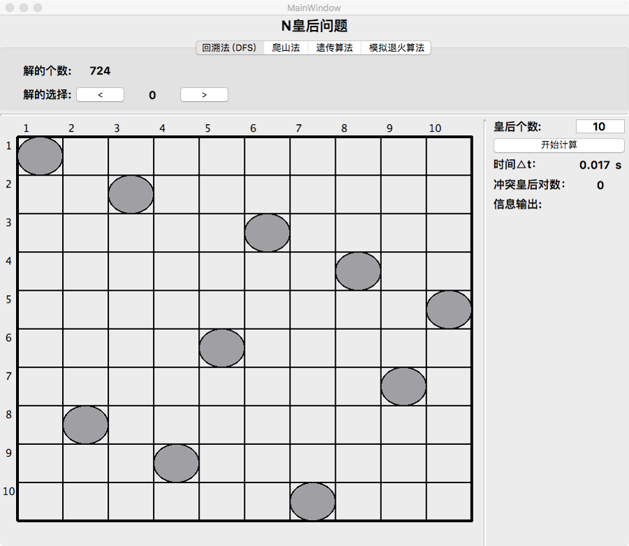
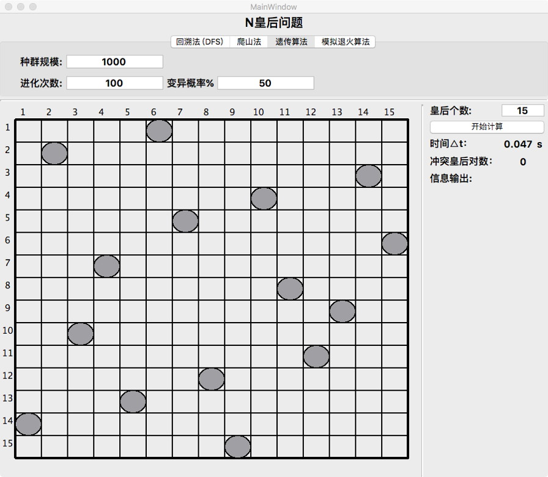
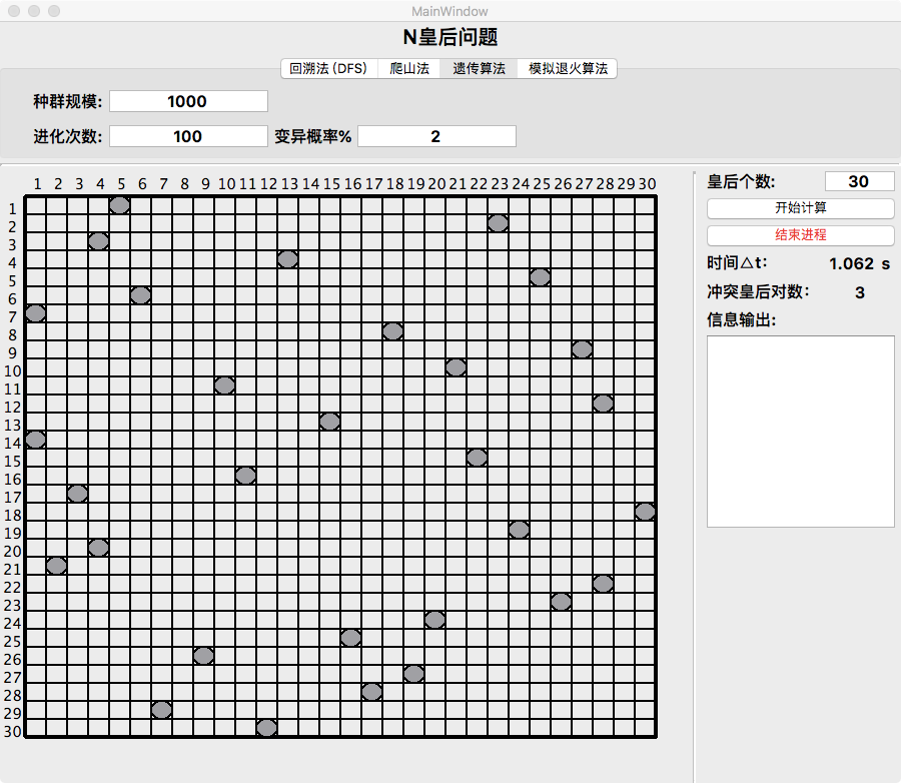
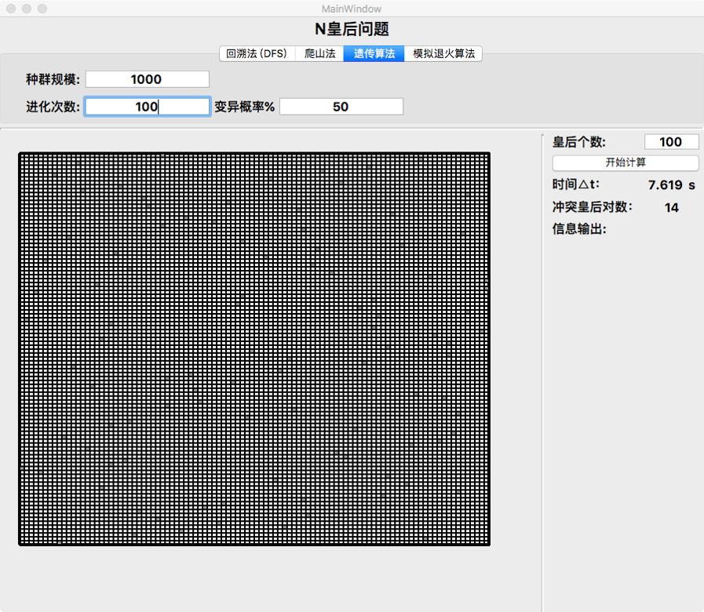
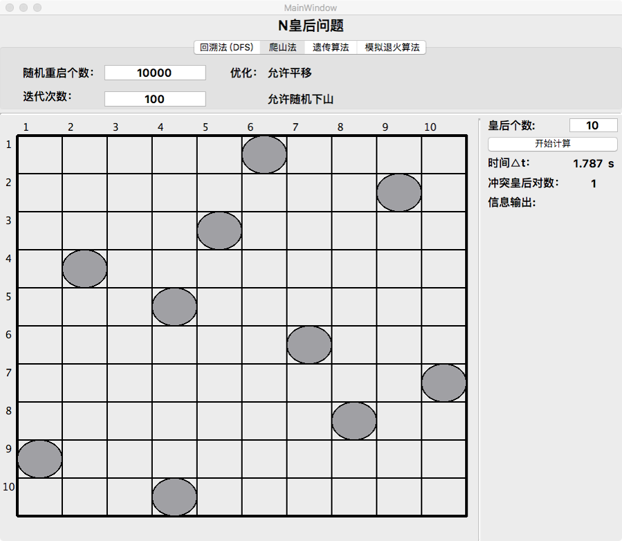
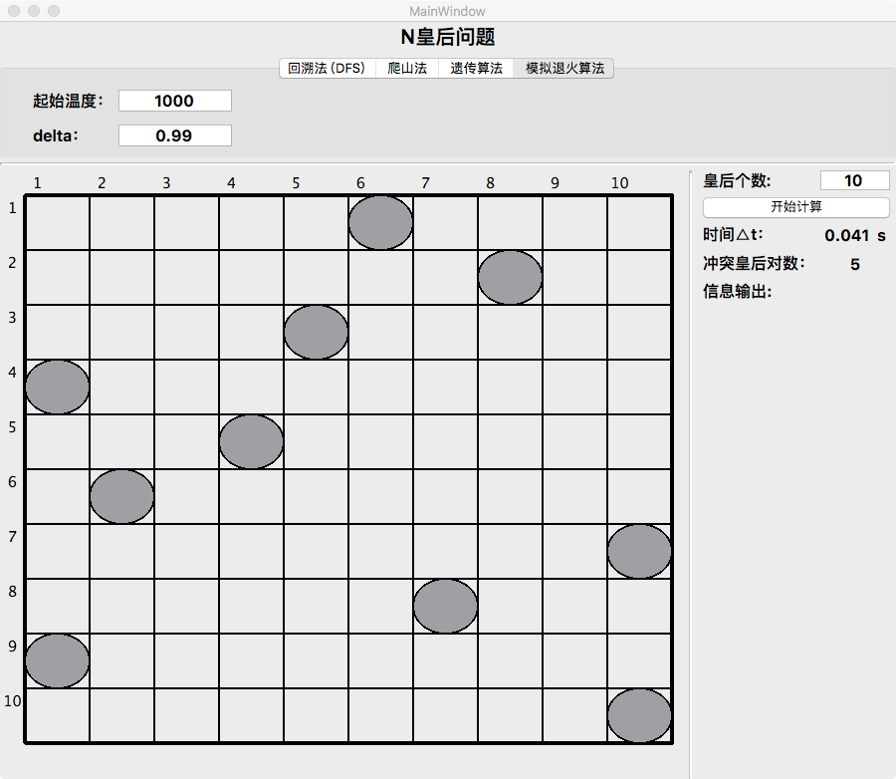

# HA_HeuristicAlgorithm
[“人工智能基础”课程设计] 优化问题与启发式算法—利用多种启发式算法解决N皇后问题（NP完全问题）：遗传算法、模拟退火算法、爬山法

## 1.软件系统界面展示：

### 回溯法（10个皇后）

### 遗传算法（15个皇后）

### 遗传算法（30个皇后）

### 遗传算法（100个皇后）

### 爬山法（随机重启，允许下山、平移）

### 模拟退火算法.png

